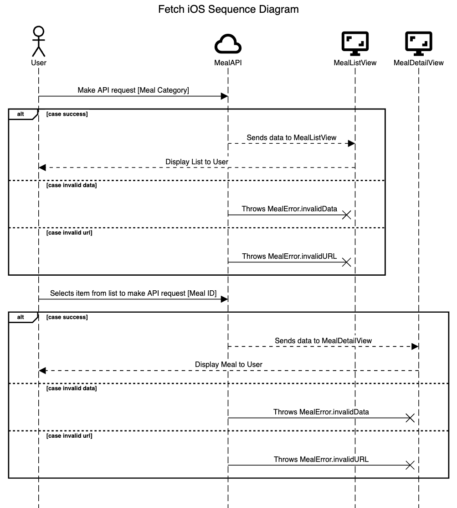

# Fetch iOS: iOS Coding Challenge

## Overview

This is a native iOS app that allows users to browse recipes using the following API:
- [MealDB](https://themealdb.com/api.php)

The app utilizes 2 endpoints:
- [Fetching the list of meals in the Dessert category](https://themealdb.com/api/json/v1/1/filter.php?c=Dessert)
- [Fetching meal details by ID](https://themealdb.com/api/json/v1/1/lookup.php?i=MEAL_ID)

The user is shown the list of meals in the Desserts category, sorted alphabetically

The user can click on a meal to view its details which include:
- Meal name
- Instruction
- Ingredients and its measurements

## Sequence Diagram

## Configure the Project

To build this project for iOS 17.2, use Xcode 15.4. The runtime requirement is iOS 17.2.

To configure the iOS and macOS app targets without an Apple Developer account, follow these steps:

1. In the targets’ Signing & Capabilities panes click Add Account, and log in with your Apple ID.
2. Chose the Your Name (Personal Team) from the team drop down menu.
3. Click build-and-run.
4. On iOS and iPadOS devices you need to navigate to Settings > General > VPN & Device Management and trust your developer certificate.
